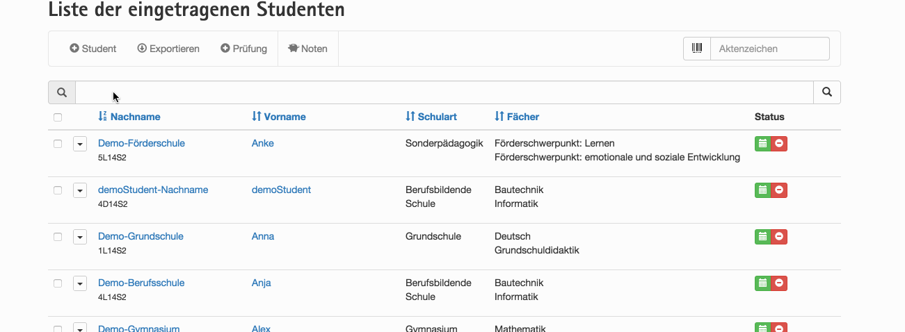

# FLOW.VisualSearch



Basicly it ships a FLUID ViewHelper and the ability to configure that viewHelper heavily, this way we can do advanced searches

You can define:

* and configure multiple Searches
* search multiple attributes of a model (uses dynamic query building)
* Repositories have to implement an interface to be searchable
* Searches are instantly stored in the user session if the user changes it

## Inclusion in a FLUID Template

To include the viewHelper you include a line like:

```
<search:widget.search search="students"/>
```

This way you define, that ```students``` is the key for storing the filter query in the session for later usage.

In the studentsRepository you can use the following function to get the filtered students:

```
<?php
namespace SBS\LaPo\Domain\Repository;

/*                                                                        *
 * This script belongs to the TYPO3 Flow package "SBS.LaPo".              *
 *                                                                        *
 *                                                                        */

use KayStrobach\VisualSearch\Domain\Repository\SearchableRepository;
use TYPO3\Flow\Annotations as Flow;
use TYPO3\Flow\Reflection\ObjectAccess;

/**
 * @Flow\Scope("singleton")
 */
class StudentRepository extends SearchableRepository {
	/**
	 * @Flow\Inject
	 * @var \TYPO3\Flow\Log\SystemLoggerInterface
	 */
	protected $systemLogger;

	/**
	 * @param array $query
	 * @return \TYPO3\Flow\Persistence\QueryResultInterface
	 */
	public function findByQuery($query) {
		$queryObject = $this->createQuery();

		$demands = $this->mapperUtility->buildQuery('lapoStudents', $query, $queryObject);

		// move easy filter to the beginning
		array_unshift($demands, $queryObject->lessThan('deleted', 1));

		$queryObject->matching(
			$queryObject->logicalAnd(
				$demands
			)
		);
		return $queryObject->execute();
	}
```

The buildQuery function is currently in a state, where is maybe moved to the SearchableRepository lateron.

In a controller you can then use these lines to filter the resultset:

```
	/**
	 * @var \KayStrobach\VisualSearch\Domain\Session\QueryStorage
	 * @Flow\Inject
	 */
	protected $queryStorage;
	
	public function indexAction() {
		$this->view->assign('students', $this->studentRepository->findByQuery($this->queryStorage->getQuery('students')));
	}
```

Additionally you need to define how the search should do the autocompletition, this is done in ```Configuration/VisualSearch.yaml``` please take a look into the example file to get an idea.
